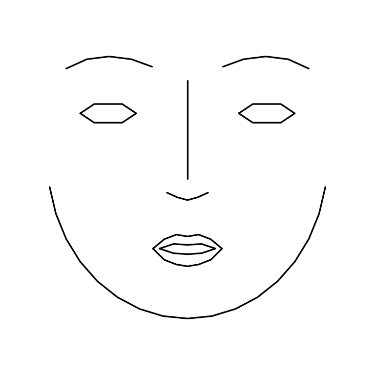
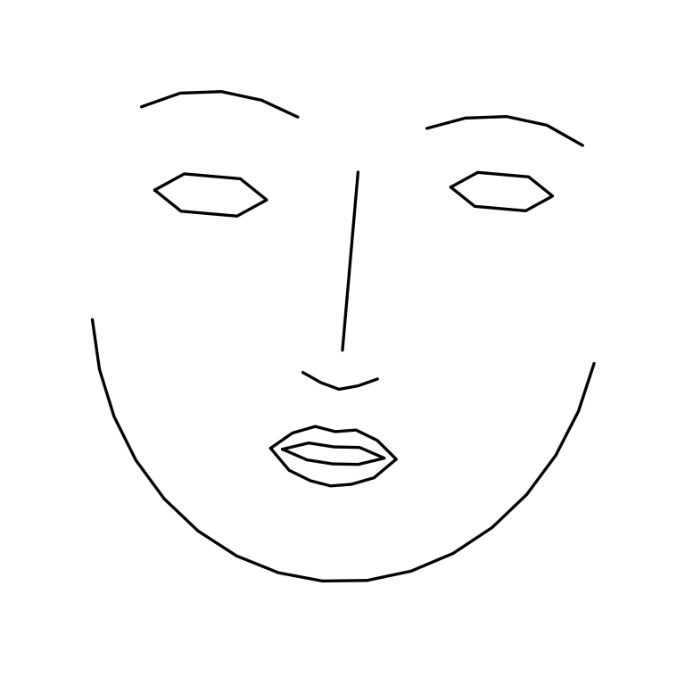
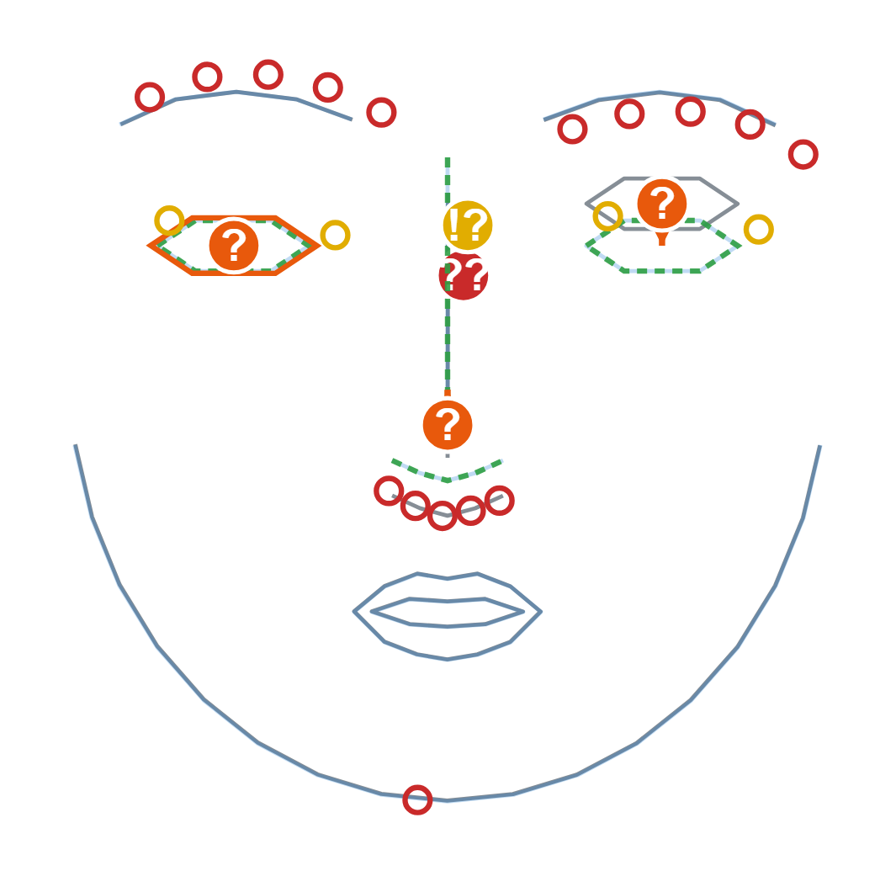

# Art Stockfish

A drawing coach that critiques a sketch the way a chess engine critiques a position. 

Give it a reference image and a sketch of it; it returns ranked, measured corrections - "the left eye sits 6% of head height too high," "the head is rotated 10° further right than the reference", drawn as an annotated overlay with ghost corrections and chess-style severity badges.


*A real sketch, critiqued end to end: grey is the student's drawing (landmarks recovered from the raw strokes), faint blue is the reference, dashed green is where the mouth should go. The `?` badge marks a mistake-tier error where the mouth is measured 6% of head height too low.*

The difference from a vision-language model is measurement. A VLM gives fluent feedback that is unmeasured, vague about where the error is, and different every time you ask. Here every number is computed from geometry, so it is exact, tied to a specific place on the face, and the same on every run. No learned model ever produces a number that appears in a critique.

## Benchmark

50 `(reference, distorted-sketch, ground-truth)` triples from a labeled distortion harness. Our pipeline runs on the landmarks; a frontier VLM runs on rendered images of the same faces with a fixed prompt asking for our exact JSON schema. Both scored identically.

<!-- BENCHMARK:START -->

Protocol: **50 triples** (reference, distorted sketch, ground-truth findings) × **3 repeats**. Same labeled errors, same scoring for both systems.

| Metric                                | Art Stockfish (ours)    | Frontier VLM (`gpt-5.5`) |                           |
| ------------------------------------- | ----------------------- | -------------------------- | ------------------------- |
| Finding precision (id+direction)      | 98.9%                   | 63.5%                      | higher is better          |
| Finding recall                        | 100.0%                  | 70.5%                      | higher is better          |
| Localization (right feature)          | 100.0%                  | 76.1%                      | higher is better          |
| Magnitude error                       | 0.0% (median abs error) | 4.7% (median abs error)    | lower is better           |
| Run-to-run consistency (Jaccard, 3×) | 1.000                   | 0.696                      | 1.0 = identical every run |

<!-- BENCHMARK:END -->

## Example

`python -m artstockfish.cli demo-synthetic` runs the full pipeline on a face with several injected errors — the reference, the drawing being graded, and the annotated critique:

<table>
<tr>
<td align="center"><b>Reference</b><br></td>
<td align="center"><b>Drawing</b><br></td>
<td align="center"><b>Critique</b><br></td>
</tr>
</table>

…and the ranked critique it prints:

```
Accuracy score: 60.3 / 100
Findings: 5 (ranked best move first)

  1. [GLOBAL    blunder    ??] The midface is 23% too tall relative to the reference — shorten the midface.
  2. [PLACEMENT mistake     ?] The left eye sits 6% of head height too high — bring it down to meet the reference.
  3. [PLACEMENT mistake     ?] The right eye is drawn 21% too large — draw it smaller to match the reference.
  4. [PLACEMENT mistake     ?] The nose sits 5% of head height too low — bring it up to meet the reference.
  5. [PLACEMENT inaccuracy !?] The eye spacing is 6% too narrow — spread the eyes farther apart.
```

The structural error is surfaced first and feature fixes follow. That ordering , coarse to fine, is the atelier teaching order, and it is the thing a raw coordinate diff gets wrong.

## How it works

Both images are reduced to 68 facial landmarks - detected on the reference, then transferred onto the sketch's strokes by registering one point set to the other. The sketch is aligned to the reference using only translation, rotation, and uniform scale, and whatever still doesn't line up after that is, by definition, the drawing error. The remaining offset is measured in a few ways - where each feature sits and how big it is, the proportions between features, the angles of the eye and mouth lines, the head's rotation, the curve of the jaw - and each measurement past a threshold becomes one finding with a size and a severity. Findings are sorted from coarse to fine, so a problem with the overall structure comes before a problem with one feature.

Some of the constraints are deliberate. The alignment is kept weak on purpose: a more flexible fit would quietly cancel out the proportion mistakes that are the whole point of critiquing a drawing. Every number is computed from geometry rather than predicted by a model, so the same sketch always gives the same report; a language model can optionally reword the findings, but a check throws out anything it adds that the geometry didn't say. The head's rotation is estimated and reported but never imposed back on the sketch - a beginner's drawing isn't an accurate projection of a real head, and forcing one would smooth the mistakes away.

## Run it

```bash
pip install -e .
python -m artstockfish.cli demo-synthetic     # ranked critique + overlay, no data needed

pip install -e .[detect]                      # real image files
artstockfish critique ref.jpg sketch.png

pip install -e .[web] && artstockfish web     # interactive SVG at http://127.0.0.1:8000
pytest                                         # the test suite

python -m benchmark.run --provider none       # reproduce our column (no API key)
```

The VLM column needs a key in a gitignored `.env` (copy `.env.example`), then `python -m benchmark.run --provider openai` (or `anthropic`).

## Testing

The system is checked by taking a face, distorting it in known ways, and confirming it reports those distortions and nothing else. On clean landmark inputs it recovers them at 98.9% precision and 100% recall; run end to end on real images, where landmark detection adds its own noise, it holds 86% / 89%. Each stage of the pipeline has its own test under `tests/`.

The longer design notes — why the method is shaped this way, and a record of the choices made along the way — are in `ART_STOCKFISH_SPEC.md`, `IMPLEMENTATION_PLAN.md`, and `DECISIONS.md`.

*Née Sketchfish. Still a fan of fish.*
