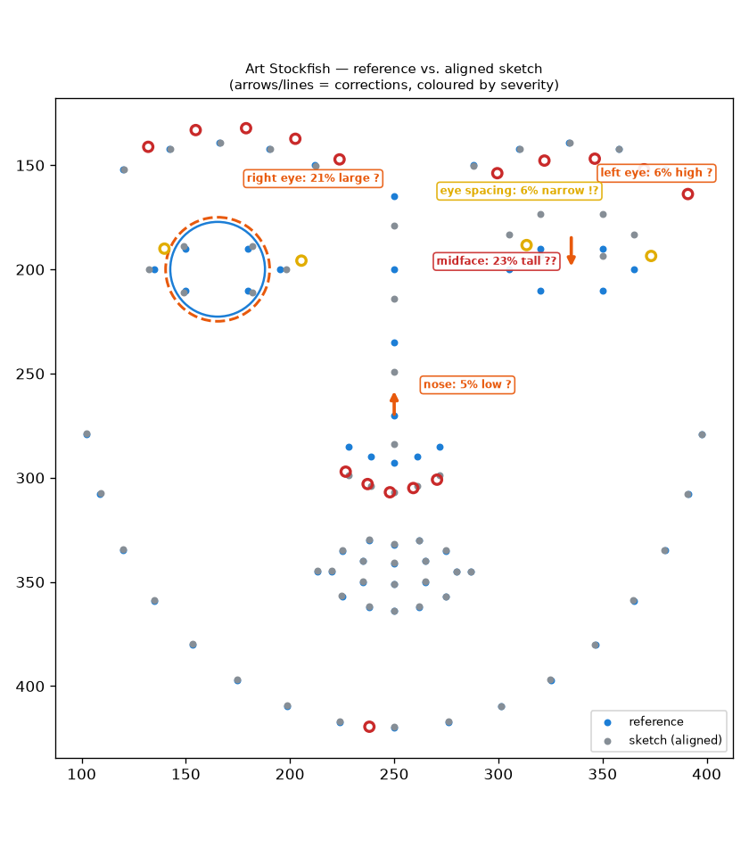

# Art Stockfish

A computer-vision drawing coach. Give it a **reference image** and a **student's sketch** of
it and it returns teacher-like critique grounded in *measured geometry*, not aesthetics — "the
left eye sits 6% of head height too high," "the jaw contour bulges outward between the eye line
and the mouth line," "the head is rotated 10° further right than the reference" — ranked best-
move-first and drawn as a chess.com-style annotated overlay with arrows, ghost corrections, and
severity badges.

The name is the design document. A chess engine has a board representation, an evaluation
function that is a weighted sum of interpretable terms, and a "best move"; Art Stockfish has a
landmark graph plus vectorized contours, an evaluation that is a weighted sum of interpretable
*geometric error* terms, and a highest-leverage correction ranked coarse-to-fine. The blunder /
mistake / inaccuracy tiers are error-magnitude bands and the accuracy "eval bar" is their
aggregate. Vision-language models give fluent but unmeasured, run-to-run inconsistent, poorly-
localized feedback; the whole bet here is that critique you can *measure, localize, reproduce,
and annotate* is the more useful product, and every design decision protects that edge.

## The claim

50 `(reference, distorted-sketch, ground-truth-findings)` triples are generated by a labeled
distortion harness, our deterministic pipeline runs on the landmark pairs and a frontier VLM
runs on rendered images of the same faces (a strong fixed prompt asking for critiques in our
exact JSON schema), and both are scored identically against the ground truth.

<!-- BENCHMARK:START -->
Protocol: **50 triples** (reference, distorted sketch, ground-truth findings) × **3 repeats**. Same labeled errors, same scoring for both systems.

| Metric | Art Stockfish (ours) | Frontier VLM (`gpt-5.5`) | |
|---|---|---|---|
| Finding precision (id+direction) | 98.9% | 63.5% | higher is better |
| Finding recall | 100.0% | 70.5% | higher is better |
| Localization (right feature) | 100.0% | 76.1% | higher is better |
| Magnitude error | 0.0% (median |err|) | 4.7% (median |err|) | lower is better |
| Run-to-run consistency (Jaccard, 3×) | 1.000 | 0.696 | 1.0 = identical every run |
<!-- BENCHMARK:END -->

The gap is structural, not a tuning win. The VLM column moves between runs because sampling is
stochastic; ours is bit-for-bit identical because the numbers come from a Procrustes fit and a
few ratios, never from a model. The magnitude column is the sharp one — we report the injected
error to the digit because we measured it, the VLM guesses a plausible percent.

## See it work

`python -m artstockfish.cli demo-synthetic` runs the full pipeline on a canonical face against a
realistically-perturbed copy and saves the overlay below:



```
Art Stockfish — synthetic M0 demo
============================================================
Accuracy score: 60.3 / 100
Findings: 5 (ranked best move first)

  1. [GLOBAL    blunder    ??] The midface is 23% too tall relative to the reference — shorten the midface. Fix this before refining details.
  2. [PLACEMENT mistake     ?] The left eye sits 6% of head height too high — bring it down to meet the reference. Fix this before refining details.
  3. [PLACEMENT mistake     ?] The right eye is drawn 21% too large — draw it smaller to match the reference. Fix this before refining details.
  4. [PLACEMENT mistake     ?] The nose sits 5% of head height too low — bring it up to meet the reference. Fix this before refining details.
  5. [PLACEMENT inaccuracy !?] The eye spacing is 6% too narrow relative to the reference — spread the eyes farther apart.
```

The structural error (the midface is too tall) is surfaced before any feature fix, which is the
atelier teaching order and the thing a coordinate diff gets wrong. On real image files
`artstockfish critique ref.jpg sketch.png` does the same end to end, and `artstockfish web`
serves an interactive SVG of the same overlay where clicking a finding highlights its
annotation.

## Design principles (the non-negotiables)

These are load-bearing; the project is largely a defense of them.

- **Measurement is deterministic geometry.** No learned model ever produces a number that
  reaches a critique. ML is allowed *only* for correspondence (finding where the landmarks and
  contours are); an LLM is allowed *only* to paraphrase an already-computed findings struct into
  warmer language, and a code-enforced guard rejects any rewrite that introduces a feature,
  number, or axis the finding doesn't support — so a hallucination can't reach the user.
- **The alignment transform class defines the critique semantics.** Sketch and reference are
  registered with a **similarity transform only** — translation, rotation, uniform scale. Affine
  or homography would absorb exactly the proportion errors a teacher critiques; whatever the
  transform can absorb is something the system goes blind to, so the transform is kept
  deliberately weak.
- **Alignment is robust.** One huge drawing error must not drag the fit and smear blame across
  the features that were drawn correctly; the Procrustes solve is IRLS-trimmed so the worst
  residuals down-weight themselves out, and there is a test (M0-T3) that fails under naive
  least-squares on purpose.
- **3D is attribution only.** A beginner's drawing is not a valid projection of any 3D scene and
  its inconsistencies *are* the signal, so fitting 3D to the sketch would regularize the errors
  away; the only 3D operation permitted is estimating head pose for each image independently via
  `solvePnP`, reporting the difference as one finding, and optionally reprojecting the reference
  at the student's pose before local residuals.
- **Ranking is coarse-to-fine.** Global pose / tilt / proportion outranks feature placement
  which outranks local contour shape, and a detail-level finding is never surfaced above an
  unresolved structural one.
- **Deterministic and stable.** Same input, same report; slightly jittered input, same findings
  (tested over 20 jittered runs). If the critique flips between runs the user stops trusting it.

## How it works

```
reference photo ──► landmarks + contours ─┐
                                          ├─► correspondence ─► robust similarity
student sketch ──► clean / vectorize ─────┘        alignment (Procrustes)
                                                        │
                              pose attribution (solvePnP both sides; if the heads differ,
                              one GLOBAL finding + reproject the reference at the student pose)
                                                        │
                              geometric measurement (residuals, canon ratios, line angles,
                              signed contour deviation, negative space)
                                                        │
                              evaluation (importance weights × magnitudes → ranked findings,
                              aggregate accuracy = 100·exp(−k·Σ score))
                                                        │
                          ┌─────────────────────────────┴───────────────┐
                  critique text (templates,                    annotated overlay
                  optional guarded paraphrase)                 (SVG: arrows / ghost / badges)
```

Every residual is expressed in a face frame anchored to the reference — origin at the centroid,
y-axis along the midline, unit length = head height — so a magnitude reads as "% of head height"
and is size- and tilt-invariant. A subtle but important step suppresses *symptom* findings: a
single eye shifted up also tilts the eye-line fit, so reporting both double-counts one mistake;
a counterfactual corrects the flagged placements, re-measures, and keeps an angle finding only
if it survives — a feature genuinely rotated in place survives, a tilt that was merely the
shifted eye collapses.

## What's built

Each milestone is gated by automated tests on synthetic ground truth — the distortion harness is
the project's conscience: inject known errors, assert the system reports exactly those and
nothing else.

| Milestone | What it does | Gate (passing) |
|---|---|---|
| **M0** core | robust Procrustes, face frame, landmark / proportion / angle measurement, ranking, template critique, matplotlib overlay | one 5% eye shift → exactly one finding at 5.0%; 7° page rotation → zero findings; identical inputs → accuracy 100 |
| **M1** harness | labeled, parameterized distortion generators + precision/recall/magnitude metrics | precision **0.989**, recall **1.000**, median magnitude error **0.000**; stable signature ≥ 95% under jitter |
| **M1.5** pose | independent `solvePnP` per image, one GLOBAL pose finding, reference reprojected at the student pose | +10° yaw → one pose finding, zero placement; +10° yaw plus a 5% eye shift → both, eye still 5.0% after conditioning |
| **M2** detection | MediaPipe on the reference, classical CPD landmark transfer onto the sketch's strokes, calibrated detector-noise floor | end-to-end on (photo, sketchified-distorted) pairs: precision **0.862**, recall **0.893**; two re-renders of one image → zero findings |
| **M3** contour | signed perpendicular deviation along corresponded jaw / face-oval arcs, curvature comparison, negative-space regions | 100/100 injected jaw bulges located to <10% arc length with correct sign |
| **M4** product | SVG overlay (one annotation element per finding, click-to-highlight), FastAPI `POST /critique`, one static page | posting two images → 200 with a valid ranked `Report` and a well-formed SVG |
| **M5** benchmark | the VLM comparison above, plus the optional guarded LLM verbalizer | benchmark table reproduces; the verbalizer guard falls back to templates on any hallucinated sentence |

## Run it

```bash
pip install -e .                      # core (numpy, scipy, opencv, matplotlib)
python -m artstockfish.cli demo-synthetic     # ranked critique + overlay PNG, no data needed

pip install -e .[detect]              # mediapipe + pycpd, for real image files
artstockfish critique ref.jpg sketch.png

pip install -e .[web]                 # FastAPI + SVG
artstockfish web                      # → http://127.0.0.1:8000

pytest                                # the full gate suite
```

Reproduce the benchmark — our column needs no API key:

```bash
python -m benchmark.run --provider none                  # the deterministic column
pip install -e .[bench]                                   # then for the VLM column:
python -m benchmark.run --provider openai                # gpt-5.5 (default), or
python -m benchmark.run --provider anthropic             # claude-opus-4-8
```

Put your key in a repo-root `.env` (copy `.env.example`, it is gitignored); responses are cached
on disk so the VLM column is a one-time spend, and `--model` picks a cheaper model. Numbers land
in `benchmark/results/benchmark_results.json`.

## Repository

```
src/artstockfish/
  schema.py        frozen data contract (Landmarks, Finding, Report)
  align.py         robust similarity Procrustes
  frame.py         reference face frame ("% of head height")
  measure/         landmarks · proportions · angles · pose · contour · negspace
  evaluate.py      weighting, coarse-to-fine ranking, the accuracy bar
  critique.py      template sentences + guarded optional verbalizer
  annotate.py      matplotlib debug overlay + production SVG
  detect/          mediapipe_face · cpd_register (classical landmark transfer)
  synth/           distort (labeled errors) · sketchify (XDoG + TPS warp)
  pipeline.py      end-to-end orchestration       cli.py / server.py  surfaces
benchmark/         the VLM comparison
tests/             one acceptance gate per milestone
```

The reasoning behind the build lives in three documents: **`ART_STOCKFISH_SPEC.md`** (what to
build and why the principles hold), **`IMPLEMENTATION_PLAN.md`** (build order and the
file-ownership boundaries), and **`DECISIONS.md`** (every dated departure from the spec with its
reason). `data/` is gitignored.

---

<sub>Née *Sketchfish*. Still a fan of fish.</sub>
