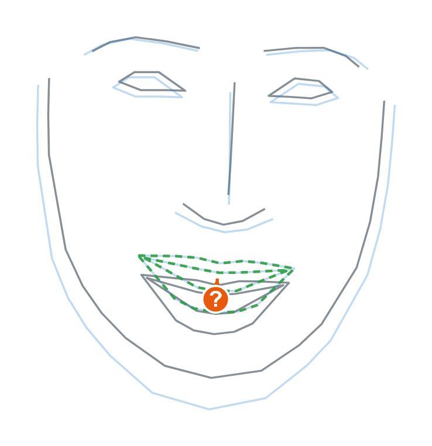

# Art Stockfish

A drawing coach that critiques a sketch the way a chess engine critiques a position. Give it a reference image and a sketch of it; it returns ranked, measured corrections — "the left eye sits 6% of head height too high," "the head is rotated 10° further right than the reference" — drawn as an annotated overlay with ghost corrections and chess-style severity badges.



*A real sketch, critiqued end to end: grey is the student's drawing (landmarks recovered from the raw strokes), faint blue is the reference, dashed green is where the mouth should go. The `?` badge marks a mistake-tier error — the mouth is measured 6% of head height too low.*

The point is measurement. A vision-language model gives fluent feedback that is unmeasured, poorly localized, and different every run. Every number here comes from geometry — a Procrustes fit, a few proportion ratios — so it is exact, localized, and identical run to run. No learned model ever produces a number that reaches a critique.

## Benchmark

50 `(reference, distorted-sketch, ground-truth)` triples from a labeled distortion harness. Our pipeline runs on the landmarks; a frontier VLM runs on rendered images of the same faces with a fixed prompt asking for our exact JSON schema. Both scored identically.

<!-- BENCHMARK:START -->
Protocol: **50 triples** (reference, distorted sketch, ground-truth findings) × **3 repeats**. Same labeled errors, same scoring for both systems.

| Metric | Art Stockfish (ours) | Frontier VLM (`gpt-5.5`) | |
|---|---|---|---|
| Finding precision (id+direction) | 98.9% | 63.5% | higher is better |
| Finding recall | 100.0% | 70.5% | higher is better |
| Localization (right feature) | 100.0% | 76.1% | higher is better |
| Magnitude error | 0.0% (median |err|) | 4.7% (median |err|) | lower is better |
| Run-to-run consistency (Jaccard, 3×) | 1.000 | 0.696 | 1.0 = identical every run |
<!-- BENCHMARK:END -->

## Example

`python -m artstockfish.cli demo-synthetic` runs the full pipeline on a face with several injected errors and prints the ranked critique:

```
Accuracy score: 60.3 / 100
Findings: 5 (ranked best move first)

  1. [GLOBAL    blunder    ??] The midface is 23% too tall relative to the reference — shorten the midface.
  2. [PLACEMENT mistake     ?] The left eye sits 6% of head height too high — bring it down to meet the reference.
  3. [PLACEMENT mistake     ?] The right eye is drawn 21% too large — draw it smaller to match the reference.
  4. [PLACEMENT mistake     ?] The nose sits 5% of head height too low — bring it up to meet the reference.
  5. [PLACEMENT inaccuracy !?] The eye spacing is 6% too narrow — spread the eyes farther apart.
```

The structural error is surfaced first and feature fixes follow. That ordering — coarse to fine — is the atelier teaching order, and it is the thing a raw coordinate diff gets wrong.

## How it works

```
reference + sketch → landmarks → robust similarity alignment (Procrustes)
                                       → pose attribution (one finding if the heads differ)
                                       → geometric measurement (residuals, ratios, angles, contours)
                                       → ranked findings → critique text + SVG overlay
```

Five commitments hold the design together:

- **Numbers come from geometry, never a model.** ML is used only to find landmarks; an optional LLM may only paraphrase finished findings, and a code guard rejects any number or feature it invents.
- **Alignment is a similarity transform only** — translation, rotation, uniform scale. A stronger transform would absorb the proportion errors a teacher is supposed to catch.
- **Alignment is robust.** One large error can't drag the fit and smear blame onto the parts drawn correctly.
- **3D is for attribution only** — pose is estimated per image and reported, never fit back onto the sketch.
- **Ranking is coarse to fine.** Pose and proportion outrank placement, which outranks local contour shape.

## Run it

```bash
pip install -e .
python -m artstockfish.cli demo-synthetic     # ranked critique + overlay, no data needed

pip install -e .[detect]                      # real image files
artstockfish critique ref.jpg sketch.png

pip install -e .[web] && artstockfish web     # interactive SVG at http://127.0.0.1:8000
pytest                                         # the acceptance-test suite

python -m benchmark.run --provider none       # reproduce our column (no API key)
```

The VLM column needs a key in a gitignored `.env` (copy `.env.example`), then `python -m benchmark.run --provider openai` (or `anthropic`).

## More

Built test-first across milestones M0–M5: a synthetic distortion harness injects known errors and asserts the system reports exactly those (precision 0.989 / recall 1.000 on landmarks, 0.862 / 0.893 end-to-end on detected real images), with one acceptance gate per milestone in `tests/`.

The reasoning behind every decision lives in **`ART_STOCKFISH_SPEC.md`** (what and why), **`IMPLEMENTATION_PLAN.md`** (build order), and **`DECISIONS.md`** (dated departures from spec).

<sub>Née *Sketchfish*. Still a fan of fish.</sub>
